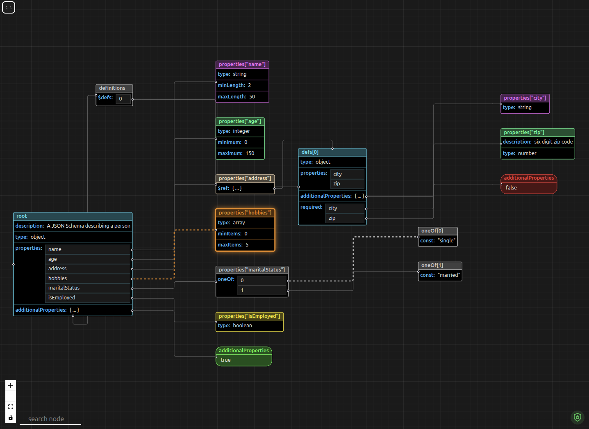

<p align="center">
  
  
</p>

# JSON Schema Studio

A visual, interactive, graph-based tool to explore, debug, and understand complex JSON Schemas.

**JSON Schema Studio** is a browser-based tool that converts JSON Schema into an interactive node graph. It helps developers understand deeply nested schemas, `$ref` chains, reusable `$defs`, and circular references
without manually tracing large JSON Schema files.

---

## Table of Contents

- [Why JSON Schema Studio?](#why-json-schema-studio)
- [Features](#features)
- [Demo](#demo)
  - [Example JSON Schema](#example-json-schema)
- [Understanding the Visualization](#understanding-the-visualization)
  - [Node colors & schema types](#node-colors--schema-types)
  - [Keywords](#keywords)
  - [Edges](#edges)
  - [reusable schemas (`$defs`)](#reusable-schemas-defs)
  - [Boolean schemas](#boolean-schemas)
  - [Controls](#controls)
- [How It Works](#how-it-works)
- [Current Limitations / Known Issues](#current-limitations--known-issues)
- [Run locally](#run-locally)
  - [Using Docker (recommended)](#using-docker-recommended)
  - [Running directly (without Docker)](#running-directly-without-docker)
- [Tech Stack](#tech-stack)
- [Future Enhancements / Roadmap](#future-enhancements--roadmap)
- [Contributing](#contributing)
  - [Getting started](#getting-started)
  - [Versioning Rules & Release Process](#versioning-rules--release-process)
    - [How to create a changeset](#how-to-create-a-changeset)
    - [When you do NOT need a changeset](#when-you-do-not-need-a-changeset)
- [Additional Notes](#additional-notes)

---

## Why JSON Schema Studio?

JSON Schemas become difficult to reason about as they grow:

- Deeply nested objects
- Heavy usage of [`$ref`](https://www.learnjsonschema.com/2020-12/core/ref)
- Circular references
- Unclear relationships between subschemas

**JSON Schema Studio** converts schemas into an interactive graph so you can **see structure, references, and relationships** instantly, instead of mentally parsing large JSON Schema files.

---

## Features

- Interactive graph-based visualization of JSON Schema
- `$ref` resolution (local & external)
- Circular reference handling
- Clear node & edge representation for schema entities
- Light & dark theme support
- Runs fully in your browser -- all data stays on your device

---

## Demo

### Example JSON Schema

```json
{
  "$schema": "https://json-schema.org/draft/2020-12/schema",
  "$id": "https://example.com/schemas/user-profile",
  "description": "A JSON Schema describing a person",
  "type": "object",
  "properties": {
    "name": {
      "type": "string",
      "minLength": 2,
      "maxLength": 50
    },
    "age": {
      "type": "integer",
      "minimum": 0,
      "maximum": 150
    },
    "address": {
      "$ref": "#/$defs/address"
    },
    "hobbies": {
      "type": "array",
      "minItems": 0,
      "maxItems": 5
    },
    "maritalStatus": {
      "oneOf": [{ "const": "single" }, { "const": "married" }]
    },
    "isEmployed": {
      "type": "boolean"
    }
  },
  "additionalProperties": true,
  "$defs": {
    "address": {
      "type": "object",
      "properties": {
        "city": {
          "type": "string"
        },
        "zip": {
          "description": "six digit zip code",
          "type": "number"
        },
        "additionalProperties": false
      },
      "required": ["city", "zip"]
    }
  }
}
```


_This diagram shows the structure of the "Example JSON Schema" above._

---

## Understanding the Visualization

The visualization represents a JSON Schema as a graph, making it easier to understand complex structures.

- **Nodes** represent schemas or subschemas  
- **Edges** represent relationships between them  

This helps you quickly explore nested structures, references, and schema relationships without manually reading large JSON files.

---

### Node colors & schema types

- Each node is assigned a color based on its type (object, array, string, etc.)
- If a type is explicitly defined, the color reflects that type
- If no type is specified, the system infers it from related keywords

**Type inference priority:**
object > array > string > number

- If inference fails, a **soft gray** color is used

---

### Keywords

- Keywords inside a node describe how the schema defines data
- If a keyword contains another schema, a new node is created

---

### Edges

- Edges connect parent and child nodes
- They originate from the left side of the parent node
- Each edge corresponds to a schema keyword (e.g., `properties`, `items`, `allOf`)

**Interaction:**
- Hover → highlights the edge and shows direction
- Click → keeps the edge highlighted
- Multiple edges can be selected at the same time

---

### Reusable schemas (`$defs`)

- `$defs` are grouped into a special "definitions" node
- This node:
  - Groups reusable schemas
  - Connects to the parent schema
  - Does not represent an actual schema itself

---

### Boolean schemas

- `true` → green node  
- `false` → red node  
- These nodes use rounded borders for easy identification

---

### Controls

- Zoom and fit-view controls are available in the bottom-left corner of the visualization

---

## How It Works

- The input JSON Schema is parsed into an **AST** (Abstract Syntax Tree) using [Hyperjump JSON Schema](https://github.com/hyperjump-io/json-schema). This AST represents the full structure of the schema.  
  _All `$ref` references, both local and external, are automatically resolved by Hyperjump, so the AST includes fully expanded schemas as part of its structure_
- The resolved AST is transformed into graph **nodes** and **edges**, where each node represents a schema or subschema, and edges represent relationships between parent and child nodes.
- These nodes and edges are rendered as an interactive graph using [React Flow](https://reactflow.dev), allowing users to explore and understand the schema visually.

---

## Current Limitations / Known Issues

- Currently, it only supports visualization for the latest dialect (2020-12).
- The **search** feature is visible in the UI but not yet implemented.
- When editing a schema in real time, the node handles may appear misaligned.  
  **Workaround**: Refresh the page after editing to restore correct handle positions.
- If a `$defs` subschema references another `$defs` subschema defined later in the schema, the source/target handles will swap, and the title of the referencing node will be clipped.

These issues will be addressed as time permits. If you encounter any other problems or have suggestions, please consider opening an issue to start a discussion.

---

### Getting started

- Fork the repository

  ```bash
  git clone https://github.com/ioflux-org/studio-json-schema.git
  ```

- Create a new branch

  ```bash
  git checkout -b feature/my-feature
  ```

- Make your changes
- Create a Pull Request
  - After making changes, don't forget to commit with the sign-off flag (-s)

  ```bash
  git commit -s -m "commit message"
  ```

  - Once all the changes have been commited, push the changes.

  ```bash
  git push origin <branch-name>
  ```

## Run locally

You can run the application locally either directly or using Docker (recommended for consistent environment).

### Using Docker (recommended)

- Build the Docker image using the `Dockerfile` at the root of the repository:
  ```bash
  docker build --no-cache -t json-schema-studio -f ./Dockerfile .
  ```
- Run the Docker container:
  ```bash
  docker run -p 8080:80 json-schema-studio
  ```
- To run the container in detached mode, use:
  ```
  docker run -d -p 8080:80 json-schema-studio
  ```
- Access the application in your browser at http://localhost:8080.

### Running directly (without Docker)

- Install dependencies:
  ```bash
  npm install
  ```
- Start the development server:
  ```
  npm run dev
  ```
- Open your browser at the URL shown in the terminal (http://localhost:5173).

> [!WARNING]
> Running directly is fine for development, but using Docker ensures a consistent environment across machines.

---

## Tech Stack

- React + Vite
- [Hyperjump JSON Schema](https://github.com/hyperjump-io/json-schema) -- validation & AST generation
- [React Flow](https://reactflow.dev/) -- graph visualization
- [Monaco Editor](https://microsoft.github.io/monaco-editor/) -- in-browser schema editor
- UI inspiration from [JSONCrack](https://github.com/AykutSarac/jsoncrack.com)

---

## Future Enhancements / Roadmap

To make this tool more accessible, intuitive, and developer-friendly, we are planning several future enhancements aimed at helping users understand and build complex JSON Schemas effortlessly.

- [ ] Export the visualization as an image
- [ ] Upload JSON Schema files directly for visualization
- [ ] VS Code extension for in-editor JSON Schema visualization
- [ ] Inline graph editing with bidirectional updates between the graph and the schema
- [ ] No-code JSON Schema generator (longer-term goal)

We'd love to hear from you! If you have ideas, suggestions, or feedback, feel free to open an issue and help shape the future of this project.

---

## Contributing

Contributions are welcome and appreciated

Ways to contribute:

- Report bugs or request features via Issues
- Improve documentation
- Fix bugs or implement new features
- Suggest better visual or UX improvement

### Versioning Rules & Release Process

We use [Changesets](https://github.com/changesets/changesets) to manage versioning, changelogs, and releases.

When you make a change that affects the application (new features, bug fixes, UI updates), you must include a changeset.

#### How to create a changeset

Run the following command in your terminal:

```bash
npx changeset
```

The CLI will prompt you to select the package(s) to bump (select `json-schema-studio` if prompted).

Choose the bump type according to Semantic Versioning (SemVer):

- `major`: Breaking changes
- `minor`: New features
- `patch`: Bug fixes

Provide a clear summary of your changes. This will be included in `CHANGELOG.md`.

Once completed, a new markdown file will be generated in the `.changeset` folder. Commit this file along with your code changes.

#### When you do NOT need a changeset

You do not need to generate a changeset if your PR only touches:

- `.github/**` (CI/CD workflows)
- `*.md` files (Documentation)
- Internal tests or tooling not affecting the shipped application

### Enforcement
>
> [!IMPORTANT]
> Pull requests without a changeset file will be blocked by CI.
>
> This policy ensures all changes are properly versioned and that every integration remains clean, predictable, and traceable.

---

## Additional Notes

> [!TIP]
> The application supports both **light** and **dark** themes. For the best visual experience -- we recommend using the **dark theme**.

> [!IMPORTANT]
> All data processing occurs **locally on your device.** No data is sent to or processed on external servers.
